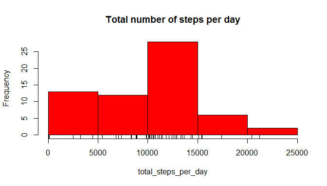
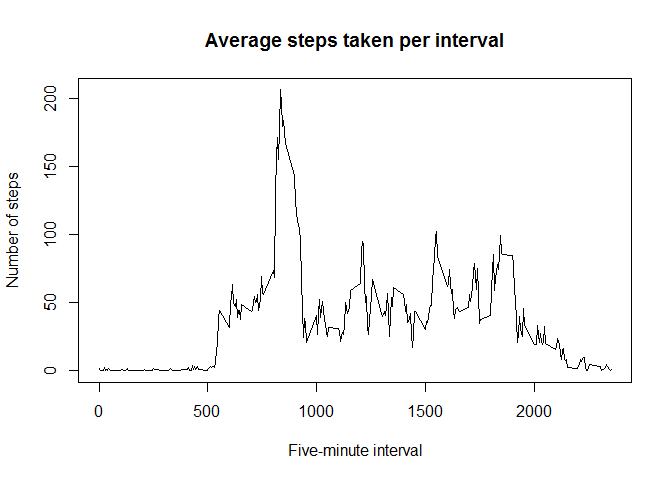
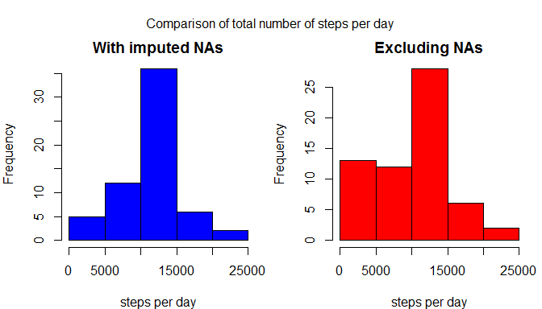
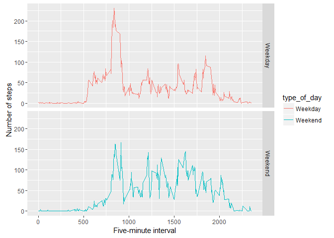

Loading and preprocessing the data
----------------------------------

We will first load the data ("activity.zip") from the current working
directory:

    if(!file.exists("activity.csv")) {
      # Unzip the data
      unzip("repdata-data-activity.zip")
    }

    activity_data<-read.csv("activity.csv", stringsAsFactors=FALSE)

Now we need to process the date column as a Date format:

    activity_data$date<-as.Date(activity_data$date)

What is mean total number of steps taken per day?
-------------------------------------------------

First we need to calculate the total number of steps taken per day by
using tapply and ignoring NA values (for this part of the assignment we
will ignore the missing values in the dataset). Then we will plot an
histogram of the total number of steps taken each day (we include a
"rug" to see where the data is concentrated).

    total_steps_per_day<-tapply(activity_data$steps,activity_data$date,sum,na.rm=TRUE)
    hist(total_steps_per_day,main="Total number of steps per day",col="red")
    rug(total_steps_per_day)

<!-- -->

Once we have the total number of steps taken per day, we can calculate
the mean and the median of the total steps per day:

    mean_total_steps<-round(mean(total_steps_per_day,na.rm = TRUE),digits=0)
    median_total_steps<-round(median(total_steps_per_day,na.rm = TRUE),digits=0)

We can see that the mean is 9354 per day and the median is 10395

What is the average daily activity pattern?
-------------------------------------------

In order to investigate the average daily pattern, we will now make a
plot of the average steps taken per interval (0-2355) across all days:

    total_steps_per_interval<-as.data.frame(cbind(unique(activity_data$interval),tapply(activity_data$steps,activity_data$interval,mean,na.rm=TRUE)))
    colnames(total_steps_per_interval)<-c("interval","steps")

    plot(total_steps_per_interval$interval,total_steps_per_interval$steps,type="l",xlab="Five-minute interval",ylab="Number of steps",main="Average steps taken per interval")

<!-- -->

    # calculate the maximum
    max_daily_steps<- total_steps_per_interval[which.max(total_steps_per_interval$steps),2]
    max_daily_steps_interval<- total_steps_per_interval[which.max(total_steps_per_interval$steps),1]

We can now say that, on average, the 5-minute interval number 835
contains the maximum number of steps (206.1698113)

Imputing missing values
-----------------------

There are a number of days/intervals where there are missing values
(coded as NA). The presence of missing days may introduce bias into some
calculations or summaries of the data.

    NAs_index<-is.na(activity_data$steps)
    num_NAs<-sum(NAs_index)

The number of missing values is 2304, so we need to fill the missing
data with the *mean for the corresponding 5-minute interval*. We will
create a new dataset that is equal to the original dataset but with the
missing data filled in. For taht we first merge the activity data with
the data frame containing the 5min interval mean, and then we replace
the missing values with the mean value for the interval.

    activity_data_imputed<- merge(activity_data,total_steps_per_interval,by="interval",all.x=TRUE,all.y = FALSE)
    activity_data_imputed[is.na(activity_data_imputed$steps.x),2]<-activity_data_imputed[is.na(activity_data_imputed$steps.x),4]
    activity_data_imputed$steps.y<-NULL
    names(activity_data_imputed)[2] <- "steps"

We will now plot a histogram of the total number of steps taken each day
comparing the results from the filled-in dataset and the previous
situation (without taking into account the missing values)

    par(mfrow = c(1, 2),mar = c(4, 4, 2, 1), oma = c(0, 0, 2, 0))
    total_steps_per_day_imputed<-tapply(activity_data_imputed$steps,activity_data_imputed$date,sum,na.rm=TRUE)
    hist(total_steps_per_day_imputed,main="With imputed NAs",col="blue",xlab="steps per day")
    hist(total_steps_per_day,main="Excluding NAs",col="red",xlab="steps per day")
    mtext("Comparison of total number of steps per day",outer=TRUE)

<!-- -->

After comparing both plots, we can calculate and report the mean and
median total number of steps taken per day:

    mean_total_steps_imputed<-round(mean(total_steps_per_day_imputed,na.rm = TRUE),digits=0)
    median_total_steps_imputed<-round(median(total_steps_per_day_imputed,na.rm = TRUE),digits=0)

We can see that in both cases, the mean (10766) and the median (10766)
after imputing the NA values **increases** vs the previous situation.

Are there differences in activity patterns between weekdays and weekends?
-------------------------------------------------------------------------

In order to investigate if there are differences in activity patterns
between weekdays and weekends we will create a new factor variable in
the dataset with two levels - "weekday" and "weekend" indicating whether
a given date is a weekday or weekend day.

    Sys.setlocale("LC_TIME", "English") # This is needed for a non-english install

    ## [1] "English_United States.1252"

    activity_data_imputed$type_of_day <- as.factor(ifelse(weekdays(activity_data_imputed$date) %in% c("Saturday","Sunday"), "Weekend", "Weekday")) 

Now we can plot the difference in activity patterns for each 5-minute
interval (x-axis) and the average number of steps taken, averaged across
all weekday days or weekend days:

    library(ggplot2)
    mean_steps_per_interval_imputed<-aggregate(steps ~ interval + type_of_day, data=activity_data_imputed, mean)
    ggplot(mean_steps_per_interval_imputed, aes(interval, steps)) + geom_line(aes(color=type_of_day)) + facet_grid(type_of_day ~ .) +
        xlab("Five-minute interval") + ylab("Number of steps")

<!-- -->
